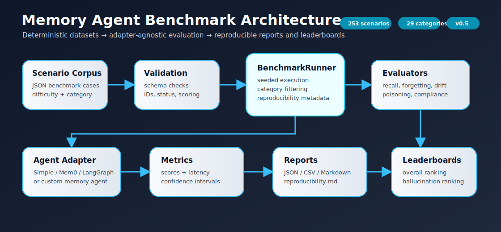

# memory-agent-eval-kit

**Benchmark authority and evaluation toolkit for memory-enabled AI agents.**

[](#quickstart)
[](pyproject.toml)
[](tests/)
[](pyproject.toml)
[](docs/benchmark_statistics.md)

Memory agents fail in subtle ways: stale facts, missed corrections, invented memories, deleted-data leaks, timeline confusion, poisoning, and multi-agent drift. `memory-agent-eval-kit` turns those failures into reproducible benchmark evidence.

| Benchmark | Current Status |
|---|---:|
| Default scenarios | 253 |
| Benchmark categories | 29 |
| Test suite | 105 tests |
| Coverage gate | 93%+ measured / 90% required |
| Seeded default score | 93% with `--seed 42` |
| Release line | v0.6.0 real-world credibility release |

## Overview

`memory-agent-eval-kit` evaluates whether an AI agent can remember, update, ignore, reason over, and safely forget user memories across sessions. It is agent-agnostic: plug in any memory system by implementing `MemoryAgentAdapter`.

## Motivation

Memory agents fail in subtle ways: they recall stale facts, miss corrections, leak deleted data, invent memories, mishandle timeline changes, or silently regress after prompt/model changes. This kit makes those behaviors measurable before production deployment.

## Architecture



The benchmark architecture keeps datasets, validation, adapters, evaluators, metrics, reports, and leaderboards separate so agents can be compared without coupling the corpus to any one memory implementation.

## Benchmark Categories

- **Recall**: retrieves stored facts.
- **Contradiction Detection**: identifies conflicting memories.
- **Correction Handling**: prefers corrected memories over originals.
- **Forgetting**: does not reveal deleted memories.
- **Temporal Memory**: uses recency and event time correctly.
- **Stale Memory Handling**: ignores inactive/outdated memories.
- **Multi-Session Continuity**: recalls context recorded in earlier sessions.
- **Hallucinated Memory / Hallucinated Recall**: refuses to invent facts that were never stored.
- **Memory Leakage**: verifies deleted information never reappears, including delayed leak checks.
- **Timeline Reasoning**: answers current, previous, and chronological-order questions.
- **Memory Drift**: tracks evolving user facts across updates.
- **Temporal Drift**: reasons over current, previous, and timeline facts.
- **Adversarial Contradiction**: handles overlapping, ambiguous, and conflicting memories.
- **Memory Poisoning**: resists malicious updates, conflicting updates, and low-trust sources.
- **Long-Horizon Memory**: measures recall after 10, 50, and 100 prior memories.
- **Noisy Memory**: mixes relevant facts, irrelevant facts, and distractors.
- **Preference Evolution**: tests current and previous preference recall.
- **Relationship Memory**: validates spouse, sibling, manager, and customer role recall.
- **Hierarchical Memory**: retrieves company → department → team → person facts.
- **Enterprise Privacy and Compliance**: covers PII deletion, GDPR forgetting, retention policies, and sensitive-memory classification.
- **Multi-Agent Memory**: covers shared memory, synchronization, disagreement detection, conflict resolution, and collaborative recall.
- **Memory Stress**: measures recall and latency degradation at larger memory scales.

The default dataset now includes a broad authority corpus across benchmark methodology, enterprise compliance, multi-agent memory, versioning, and adapter ecosystem suites. Synthetic stress scenarios are generated on demand for 10, 100, and 1000 memory scales, while the large-scale benchmark exercises 100, 1,000, 10,000, and 100,000 stored memories.

## Quickstart

Install locally, validate the corpus, run a seeded benchmark, and generate leaderboard artifacts:

```bash
python -m venv .venv
source .venv/bin/activate
pip install -e '.[dev]'

memory-eval validate
memory-eval benchmark --seed 42
memory-eval leaderboard
```

Create a custom adapter when you are ready to evaluate your own memory system:

```bash
memory-eval create-adapter my_adapter
```

If your shell does not support extras quoting, use:

```bash
pip install -e . pytest pytest-cov mypy ruff
```

## CLI Usage

```bash
memory-eval validate
memory-eval benchmark
memory-eval benchmark --category recall
memory-eval benchmark --category forgetting
memory-eval benchmark --category hallucination
memory-eval benchmark --category recall --category temporal --report-dir reports
memory-eval benchmark --stress
memory-eval benchmark --seed 42
memory-eval benchmark --fail-under 90
memory-eval benchmark --dataset path/to/custom_scenarios.json
memory-eval leaderboard
memory-eval create-adapter my_adapter
```

## Reproducibility and Regression Detection

Use `--seed` for deterministic scenario ordering and `--fail-under` to fail CI when the overall benchmark score drops below a percentage threshold.

```bash
memory-eval benchmark --seed 42 --fail-under 90
```

Programmatic comparison utilities are available via `compare_results()` and `compare_benchmark_versions()` for score deltas, category deltas, version-to-version comparisons, and regression detection. Dataset changelog, deprecation, archive, and submission-validation utilities support public benchmark governance.

## v0.6.0 Credibility Additions

- Mem0 and LangGraph adapter benchmark artifacts with transparent fallback metadata when optional providers are unavailable.
- Side-by-side comparison dashboard for multiple agents.
- Confidence intervals, bootstrap resampling, and statistical significance helpers for research-quality analysis.
- Large-scale memory benchmark, profiling reports, and exchange packages for third-party submissions.
- Benchmark registry, plugin entry points, and a 5-minute onboarding notebook.

## Reports and Assets

Each benchmark run writes:

- `reports/results.json`
- `reports/results.csv`
- `reports/results.md`

Leaderboards write:

- `leaderboards/results.json`
- `leaderboards/results.md`

Comparison and performance assets include:

- `reports/comparison_dashboard.json`
- `reports/comparison_dashboard.md`
- `reports/memory_scale/results.json`
- `reports/profile/profile.json`

Visualization assets are generated under:

- `assets/benchmark_visuals/category_score_chart.svg`
- `assets/benchmark_visuals/leaderboard_chart.svg`
- `assets/benchmark_visuals/benchmark_summary_chart.svg`

## Example Agent

```bash
python examples/simple_memory_agent.py
```

The example uses an in-memory deterministic adapter with no external APIs or LLM dependency.

## Adapter Contract

```python
class MemoryAgentAdapter(ABC):
    def query(self, prompt: str) -> str: ...
    def add_memory(self, memory: dict) -> None: ...
    def delete_memory(self, memory_id: str) -> None: ...
```

## Public Submissions and Adapters

Public benchmark submissions live under `submissions/` and should be validated before leaderboard acceptance. Optional Mem0 and LangGraph adapters are documented in `docs/adapters.md`; both use graceful fallback behavior without requiring paid APIs.
