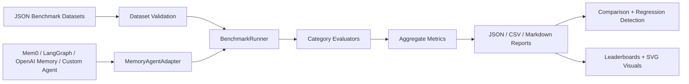

# memory-agent-eval-kit

Benchmark authority and evaluation toolkit for memory-enabled AI agents.

## Overview

`memory-agent-eval-kit` evaluates whether an AI agent can remember, update, ignore, reason over, and safely forget user memories across sessions. It is agent-agnostic: plug in any memory system by implementing `MemoryAgentAdapter`.

## Motivation

Memory agents fail in subtle ways: they recall stale facts, miss corrections, leak deleted data, invent memories, mishandle timeline changes, or silently regress after prompt/model changes. This kit makes those behaviors measurable before production deployment.

## Architecture



## Benchmark Categories

- **Recall**: retrieves stored facts.
- **Contradiction Detection**: identifies conflicting memories.
- **Correction Handling**: prefers corrected memories over originals.
- **Forgetting**: does not reveal deleted memories.
- **Temporal Memory**: uses recency and event time correctly.
- **Stale Memory Handling**: ignores inactive/outdated memories.
- **Multi-Session Continuity**: recalls context recorded in earlier sessions.
- **Hallucinated Memory / Hallucinated Recall**: refuses to invent facts that were never stored.
- **Memory Leakage**: verifies deleted information never reappears, including delayed leak checks.
- **Timeline Reasoning**: answers current, previous, and chronological-order questions.
- **Memory Drift**: tracks evolving user facts across updates.
- **Temporal Drift**: reasons over current, previous, and timeline facts.
- **Adversarial Contradiction**: handles overlapping, ambiguous, and conflicting memories.
- **Memory Poisoning**: resists malicious updates, conflicting updates, and low-trust sources.
- **Long-Horizon Memory**: measures recall after 10, 50, and 100 prior memories.
- **Noisy Memory**: mixes relevant facts, irrelevant facts, and distractors.
- **Preference Evolution**: tests current and previous preference recall.
- **Relationship Memory**: validates spouse, sibling, manager, and customer role recall.
- **Hierarchical Memory**: retrieves company → department → team → person facts.
- **Enterprise Privacy and Compliance**: covers PII deletion, GDPR forgetting, retention policies, and sensitive-memory classification.
- **Multi-Agent Memory**: covers shared memory, synchronization, disagreement detection, conflict resolution, and collaborative recall.
- **Memory Stress**: measures recall and latency degradation at larger memory scales.

The default dataset now includes a broad v0.4.0 corpus across benchmark authority, enterprise compliance, multi-agent memory, versioning, and adapter ecosystem suites. Synthetic stress scenarios are generated on demand for 10, 100, and 1000 memory scales.

## Quickstart

```bash
python -m venv .venv
source .venv/bin/activate
pip install -e '.[dev]'
memory-eval validate
memory-eval benchmark --seed 42
memory-eval leaderboard
memory-eval create-adapter my_adapter
```

If your shell does not support extras quoting, use:

```bash
pip install -e . pytest pytest-cov mypy ruff
```

## CLI Usage

```bash
memory-eval validate
memory-eval benchmark
memory-eval benchmark --category recall
memory-eval benchmark --category forgetting
memory-eval benchmark --category hallucination
memory-eval benchmark --category recall --category temporal --report-dir reports
memory-eval benchmark --stress
memory-eval benchmark --seed 42
memory-eval benchmark --fail-under 90
memory-eval benchmark --dataset path/to/custom_scenarios.json
memory-eval leaderboard
memory-eval create-adapter my_adapter
```

## Reproducibility and Regression Detection

Use `--seed` for deterministic scenario ordering and `--fail-under` to fail CI when the overall benchmark score drops below a percentage threshold.

```bash
memory-eval benchmark --seed 42 --fail-under 90
```

Programmatic comparison utilities are available via `compare_results()` and `compare_benchmark_versions()` for score deltas, category deltas, version-to-version comparisons, and regression detection. Dataset changelog, deprecation, archive, and submission-validation utilities support public benchmark governance.

## Reports and Assets

Each benchmark run writes:

- `reports/results.json`
- `reports/results.csv`
- `reports/results.md`

Leaderboards write:

- `leaderboards/results.json`
- `leaderboards/results.md`

Visualization assets are generated under:

- `assets/benchmark_visuals/category_score_chart.svg`
- `assets/benchmark_visuals/leaderboard_chart.svg`
- `assets/benchmark_visuals/benchmark_summary_chart.svg`

## Example Agent

```bash
python examples/simple_memory_agent.py
```

The example uses an in-memory deterministic adapter with no external APIs or LLM dependency.

## Adapter Contract

```python
class MemoryAgentAdapter(ABC):
    def query(self, prompt: str) -> str: ...
    def add_memory(self, memory: dict) -> None: ...
    def delete_memory(self, memory_id: str) -> None: ...
```

## Public Submissions and Adapters

Public benchmark submissions live under `submissions/` and should be validated before leaderboard acceptance. Optional Mem0 and LangGraph adapters are documented in `docs/adapters.md`; both use graceful fallback behavior without requiring paid APIs.
