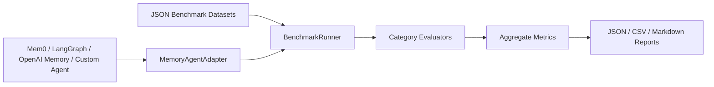

# memory-agent-eval-kit

Production-quality benchmark and evaluation framework for memory-enabled AI agents.

## Overview

`memory-agent-eval-kit` evaluates whether an AI agent can remember, update, ignore, and safely forget user memories across sessions. It is agent-agnostic: plug in any memory system by implementing `MemoryAgentAdapter`.

## Motivation

Memory agents fail in subtle ways: they recall stale facts, miss corrections, leak deleted data, forget cross-session context, or silently regress after prompt/model changes. This kit makes those behaviors measurable before production deployment.

## Architecture



## Benchmark Categories

- **Recall**: retrieves a stored fact.
- **Contradiction Detection**: identifies conflicting memories.
- **Correction Handling**: prefers corrected memories over originals.
- **Forgetting**: does not reveal deleted memories.
- **Temporal Memory**: uses recency and event time correctly.
- **Stale Memory Handling**: ignores inactive/outdated memories.
- **Multi-Session Continuity**: recalls context recorded in earlier sessions.

The default dataset contains 70 scenarios: 10 per category.

## Quickstart

```bash
python -m venv .venv
source .venv/bin/activate
pip install -e '.[dev]'
memory-eval benchmark
```

If your shell does not support extras quoting, use:

```bash
pip install -e . pytest pytest-cov mypy ruff
```

## CLI Usage

```bash
memory-eval benchmark
memory-eval benchmark --category recall
memory-eval benchmark --category recall --category temporal --report-dir reports
memory-eval benchmark --dataset path/to/custom_scenarios.json
```

## Example Output

```text
Overall Score: 91%

Recall: 95%
Contradictions: 88%
Corrections: 92%
Forgetting: 87%
Temporal: 93%
Stale Memory: 90%
Continuity: 89%
```

## Example Agent

```bash
python examples/simple_memory_agent.py
```

The example uses an in-memory deterministic adapter with no external APIs or LLM dependency.

## Adapter Contract

```python
class MemoryAgentAdapter(ABC):
    def query(self, prompt: str) -> str: ...
    def add_memory(self, memory: dict) -> None: ...
    def delete_memory(self, memory_id: str) -> None: ...
```

## Reports

Each benchmark run writes:

- `reports/results.json`
- `reports/results.csv`
- `reports/results.md`
