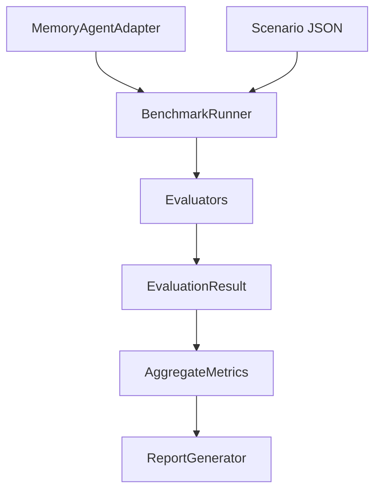

# Architecture

The framework has four layers:

1. **Adapter layer**: `MemoryAgentAdapter` abstracts any memory-enabled agent.
2. **Dataset layer**: JSON scenarios describe memory events, a query, and expected behavior.
3. **Evaluator layer**: category-specific evaluators execute scenarios and produce `EvaluationResult` records.
4. **Reporting layer**: aggregate metrics and per-scenario results are emitted as JSON, CSV, and Markdown.

The adapter interface is intentionally minimal so future integrations can wrap Mem0, LangGraph, OpenAI Memory, personal continuity agents, Memory Agent SDK, Decision Memory Agent, or internal systems.
